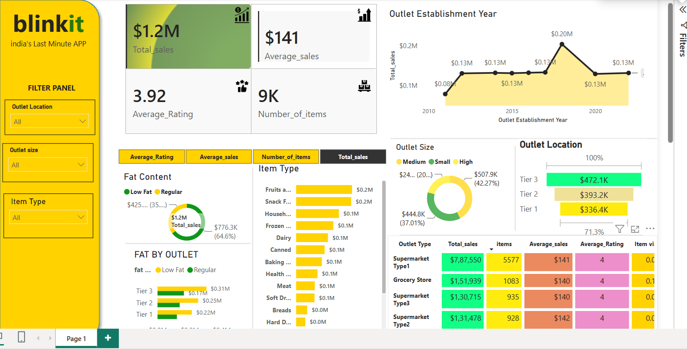

# 📊 Blinkit Sales Analysis

## 📖 Project Overview
Developed an end-to-end Data Analytics project to analyze Blinkit sales data using Python, SQL, and Power BI. The project focuses on identifying sales patterns, customer preferences, and outlet performance to generate actionable business insights through an interactive dashboard.

---

## 🎯 Business Objective
- Analyze overall sales performance.
- Identify top-performing outlet types and outlet sizes.
- Evaluate product category performance.
- Compare sales based on fat content.
- Support business decisions with data-driven insights.

---

## 🛠️ Tech Stack
- Python (Pandas, NumPy, Matplotlib)
- SQL (MySQL)
- Power BI
- GitHub

---

## 📌 Key Features
- Data Cleaning and Preprocessing
- Exploratory Data Analysis (EDA)
- SQL-based Business Queries
- Interactive Power BI Dashboard
- KPI Analysis
- Sales Trend Analysis
- Outlet Performance Analysis
- Product Category Analysis

---

## 📊 Dashboard Insights
- 💰 Total Sales
- 📦 Total Items Sold
- ⭐ Average Rating
- 💵 Average Sales
- 🏪 Sales by Outlet Type
- 📍 Sales by Outlet Size
- 🥫 Sales by Item Type
- 🥛 Fat Content Analysis
- 📈 Outlet Establishment Trend

---

## 📂 Project Files
- BLINKIT-DATA ANALYSIS.ipynb
- BLINKIT_QUERIES.sql
- BLINKIT-POWERBI.pbix
- BLINKIT DATASET.csv
- BLINKIT-DASHBOARD.png

---

## 🖼️ Dashboard Preview

---

## 👩‍💻 Author

**Anshika**

Aspiring Data Analyst | Python | SQL | Power BI

